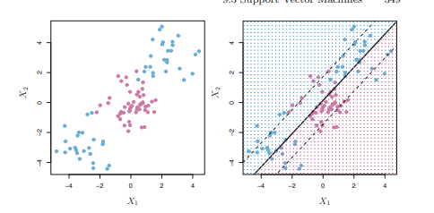

```{r setup, include=FALSE}
options(htmltools.dir.version = FALSE, digits = 4, scipen=999)
knitr::opts_chunk$set(message = FALSE, warning = FALSE, echo = FALSE)
library(tidyverse)
library(tidymodels)
library(flair)
library(kknn)
library(glmnet)
library(discrim)
```

```{r xaringan-themer, include=FALSE}
library(xaringanthemer)
library(xaringanExtra)
style_mono_light(
  base_color = "#26116c",
  text_bold_color = "#fd5e53",
  title_slide_text_color = "#fff8e7",
  background_color = "#fff8e7",
  header_font_google = google_font("Roboto"),
  text_font_google   = google_font("Roboto Condensed"),
  code_font_google   = google_font("Droid Mono")
)
```

```{css, echo = FALSE}
.red{ color: red; }
.blue{ color: blue; }
.huge {
  font-size: 200%;
}
.large {
  font-size: 150%;
}
.tiny {
  font-size: 50%;
}
```

---
class: center, middle

# Maximal Margin Classifier

---
# Maximal Margin

Let's revisit the Federalist papers data.

Recall that we plotted the essays in the first two PC dimensions, and saw that these separated the authors reasonably well:

```{r, echo = FALSE}
# Read data
fed <- read.csv("https://www.dropbox.com/s/9t8sxr1sg0monih/federalist.txt?dl=1")
fed <- fed[,-1]

# Keep numeric section only
fed_all <- as.matrix(fed[,-1])
fed_all <- apply(fed_all, 2, as.numeric)

auths <- fed$Author

# Data from papers with known authors
fed_known <- as.matrix(fed[auths != 'DIS',-1])
fed_known <- apply(fed_known, 2, as.numeric)

auths_known = auths[auths != 'DIS']

# Data from papers with unknown authors
fed_unknown <- as.matrix(fed[auths == 'DIS',-1])
fed_unknown <- apply(fed_unknown, 2, as.numeric)

fed_ex <- as_tibble(fed_known) %>% cbind(auths_known)

fed_matrix <- fed_ex %>% select(-auths_known) %>% as.matrix()
pc <- prcomp(fed_matrix, center = TRUE, scale = TRUE)

fed_pca_df <- pc$x %>%
  as.data.frame() %>%
  mutate(
    author = auths_known
  )

fed_pca_df_uk <- scale(fed_unknown) %>% 
  replace_na(0) %*% 
  pc$rotation %>%
  as_tibble() %>%
  mutate(
    author = "Unknown"
  )

fed_pca_df %>%
  ggplot(aes(x = PC1, y = PC2, color = auths_known)) +
  geom_point()
```

---
## Maximal Margin

Suppose we are interested in classifying a new observation as "John Jay" or "Not John Jay".

--

There are many lines we could draw that split the *training* data perfectly between JJ and not JJ

---


```{r}
fed_pca_df %>%
  ggplot(aes(x = PC1, y = PC2, color = author)) +
  geom_point() +
  geom_abline(slope = 5, intercept = 25) + 
  geom_abline(slope = 6, intercept = 30) +
  geom_abline(slope = 5, intercept = 22) 
```

---
## Maximal Margin

The "best" one is the one that is furthest from the nearest observation on either side.

--

```{r}
fed_pca_df %>%
  ggplot(aes(x = PC1, y = PC2, color = author)) +
  geom_point() +
  geom_abline(slope = 5, intercept = 23.25) +
  geom_abline(slope = 5, intercept = 20, lty = 2) +
  geom_abline(slope = 5, intercept = 26.5, lty = 2)
```

---
## Maximal Margin

Let's check out where the essays with **unknown authorship** fall on this plot:

---

```{r}
fed_pca_all  <- bind_rows(fed_pca_df, fed_pca_df_uk)

fed_pca_all %>%
  ggplot(aes(x = PC1, y = PC2, color = author)) +
  geom_point() +
  geom_abline(slope = 5, intercept = 23.25) +
  geom_abline(slope = 5, intercept = 20, lty = 2) +
  geom_abline(slope = 5, intercept = 26.5, lty = 2)
```


---
## Maximal Margin

Okay, so **what's the problem?**

--

In **real situation** we rarely have observations that *perfectly* fall on either side of a line/plane.

--

Adding **one more observation** could *totally change* our classification line!

--

None of the unknown essays are John Jay.

Suppose we wanted instead to separate "Hamilton" from "Not Hamilton"

---

```{r}
fed_pca_df %>%
  ggplot(aes(x = PC1, y = PC2, color = author)) +
  geom_point() +
  geom_abline(slope = 2, intercept = 2) 
```

---
## Soft Margin

A **soft margin** is a margin with only a certain number of misclassified points.

--

There are two decisions to make here:

--

1. How big is our margin?  

(`M` = width of margin)

--

2. How many misclassified observations are we willing to have?  

(`C` = cost of a misclassified point)

---

Width of margin: 2
Misclassified points in margin: 3

```{r}
fed_pca_df %>%
  ggplot(aes(x = PC1, y = PC2, color = author)) +
  geom_point() +
  geom_abline(slope = 2, intercept = 2) +
  geom_abline(slope = 2, intercept = 0, lty = 2) +
  geom_abline(slope = 2, intercept = 4, lty = 2)
```

---
## Support Vector Classifier

The **support vector** is the set of all observations that falling within the **soft margin** that are **misclassified**.

--

A **support vector classifier** tries to find:

--

a *line/plane* that will be used to classify future observations ...

--

... that give us the biggest *margin width*...

--

... while still respecting the cost, `C`.

---
## Support Vector Classifier

```{r, echo = TRUE}
svm_spec <- svm_poly(cost = 2, degree = 1) %>%
  set_mode("classification") %>%
  set_engine("kernlab")

fed_recipe <- recipe(author ~ PC1 + PC2, data = fed_pca_df)

fed_wflow <- workflow() %>%
  add_model(svm_spec) %>%
  add_recipe(fed_recipe)

my_svm <- fed_wflow %>%
  fit(fed_pca_df)
```

---

```{r, echo = TRUE}
fit <- my_svm %>% pull_workflow_fit()
fit
```


---
## Support Vector Classifier

```{r, echo = TRUE}
predict(my_svm, fed_pca_df_uk)
```

---
```{r}
fed_pca_all %>%
  mutate(
    preds = predict(my_svm, fed_pca_all)$.pred_class
  ) %>%
  ggplot(aes(x = PC1, y = PC2, color = preds, pch = author)) +
  geom_point()


```

---
## Kernels

What if we simply couldn't separate our data with a line/plane?

--



---

## Kernels

What if we imagine our points exist in **three dimensions**?

--


---

## Support Vector Machine

A **support vector machine** classifies observations using dividers in **extra dimensions**!

--

In this class, we will only implement **polynomial** svms.

---
class: center, middle, inverse

# Try it!

## Open **Activity-SVM.Rmd**

#### Fit a support vector classifier, tuning the **cost** parameter

#### Fit a support vector **machine**, tuning the **cost** parameter AND the **degree** parameter.

